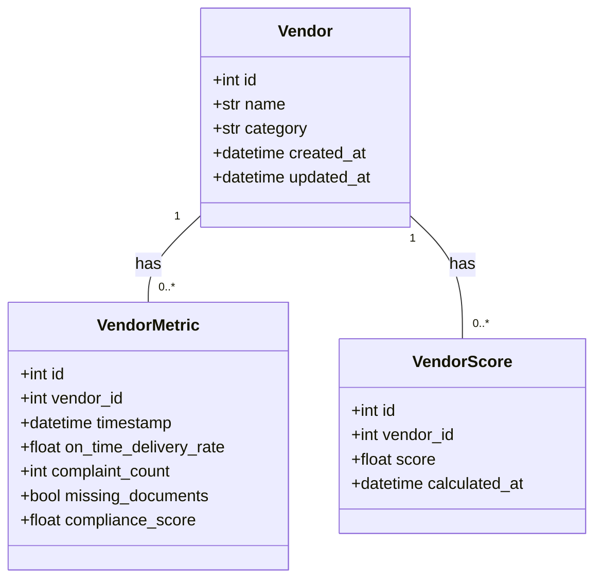

# Vendor Score Microservice

A backend microservice for managing vendor profiles, tracking performance metrics, and calculating vendor scores based on various criteria.

## 🚀 Deployment

**Base URL:** [https://vendor-microservice.onrender.com](https://vendor-microservice.onrender.com)

You can access the interactive API documentation (Swagger UI) at:
[https://vendor-microservice.onrender.com/docs](https://vendor-microservice.onrender.com/docs)

## 📋 Features

*   **Vendor Management**: Create and retrieve vendor profiles.
*   **Metric Ingestion**: Record performance metrics (delivery rate, complaints, etc.) for vendors.
*   **Scoring System**: Automatically calculates a score (0-100) based on weighted metrics.
*   **History Tracking**: View historical scores for a vendor.
*   **Periodic Recomputation**: Endpoint available to trigger score updates for all vendors.

## 🏗️ Data Structure



## 🛠️ Tech Stack

*   **Language**: Python 3.12+
*   **Framework**: FastAPI
*   **Database**: PostgreSQL (via SQLModel/SQLAlchemy)
*   **Migrations**: Alembic
*   **Testing**: pytest

## 🔢 Scoring Logic

The vendor score is calculated out of 100 based on the following formula:

1.  **On-Time Delivery**: Contributes up to **40 points**.
2.  **Compliance Score**: Contributes up to **25 points**.
3.  **Complaints**: Reduces score (penalty).
    *   Uses a diminishing returns formula: `5 * (1 - exp(-count / 5))`.
    *   Max penalty capped at **20 points**.
4.  **Missing Documents**: Fixed penalty of **15 points** if true.
5.  **Category Weight**: The final score is adjusted by a multiplier based on vendor category:
    *   `supplier`: 1.00
    *   `distributor`: 0.97
    *   `dealer`: 0.95
    *   `gold`: 1.05
    *   `silver`: 1.02

**Final Score** = `(Baseline + OnTime + Compliance - Complaints - MissingDocs) * CategoryWeight`
*Clamped between 0 and 100.*

## 🔌 API Endpoints & Curl Commands

### 1. Create a Vendor
```bash
curl -X 'POST' \
  'https://vendor-microservice.onrender.com/vendors' \
  -H 'Content-Type: application/json' \
  -d '{
  "name": "Acme Corp",
  "category": "supplier"
}'
```

### 2. Ingest Metrics
```bash
curl -X 'POST' \
  'https://vendor-microservice.onrender.com/vendors/1/metrics' \
  -H 'Content-Type: application/json' \
  -d '{
  "timestamp": "2023-11-27T10:00:00Z",
  "on_time_delivery_rate": 95.5,
  "complaint_count": 0,
  "missing_documents": false,
  "compliance_score": 90.0
}'
```

### 3. Get Vendor Details (with Latest Score)
```bash
curl -X 'GET' \
  'https://vendor-microservice.onrender.com/vendors/1'
```

### 4. Get Score History
```bash
curl -X 'GET' \
  'https://vendor-microservice.onrender.com/vendors/1/scores?limit=10&offset=0'
```

### 5. Health Check
```bash
curl -X 'GET' \
  'https://vendor-microservice.onrender.com/health'
```

## ⚙️ Local Setup

1.  **Clone the repository**:
    ```bash
    git clone https://github.com/kanakyadav192/vendor-microservice.git
    cd vendor-microservice
    ```

2.  **Create a virtual environment**:
    ```bash
    python3 -m venv venv
    source venv/bin/activate
    ```

3.  **Install dependencies**:
    ```bash
    pip install -r requirements.txt
    ```

4.  **Run the application**:
    ```bash
    uvicorn app.main:app --reload
    ```

5.  **Run Tests**:
    ```bash
    PYTHONPATH=. pytest
    ```